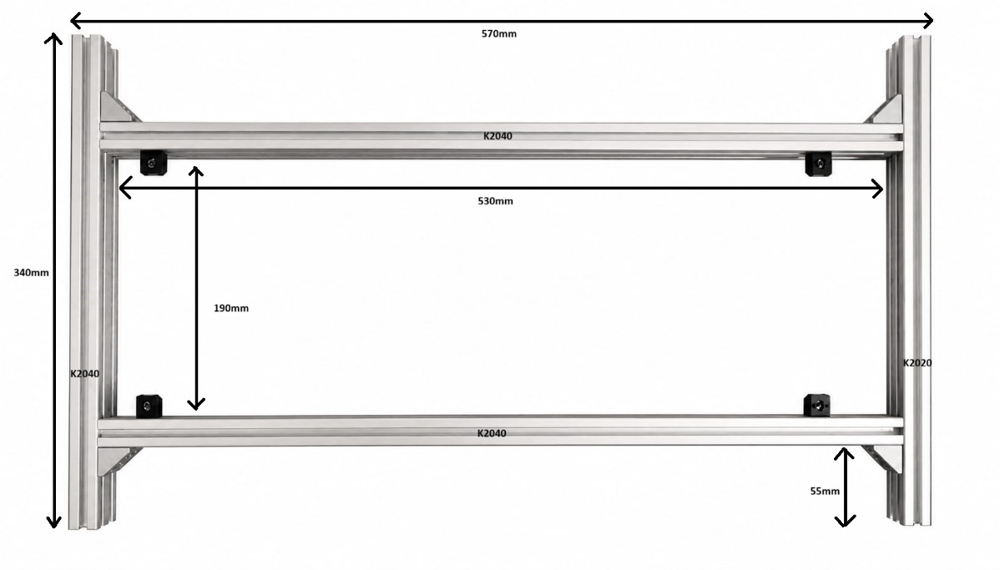
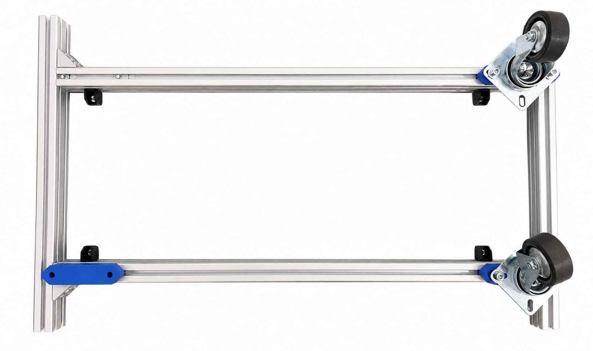
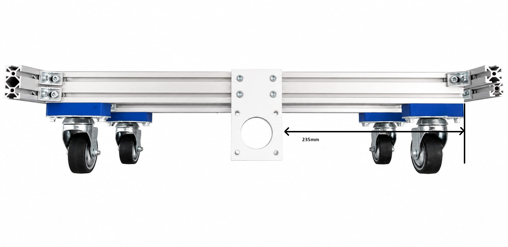
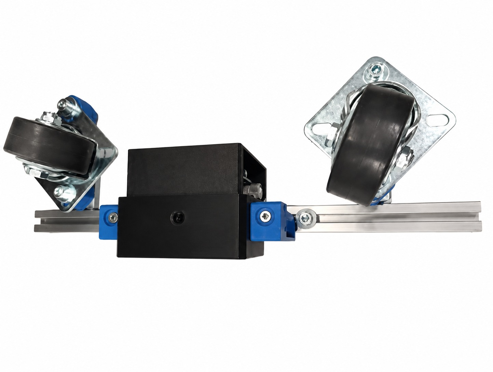
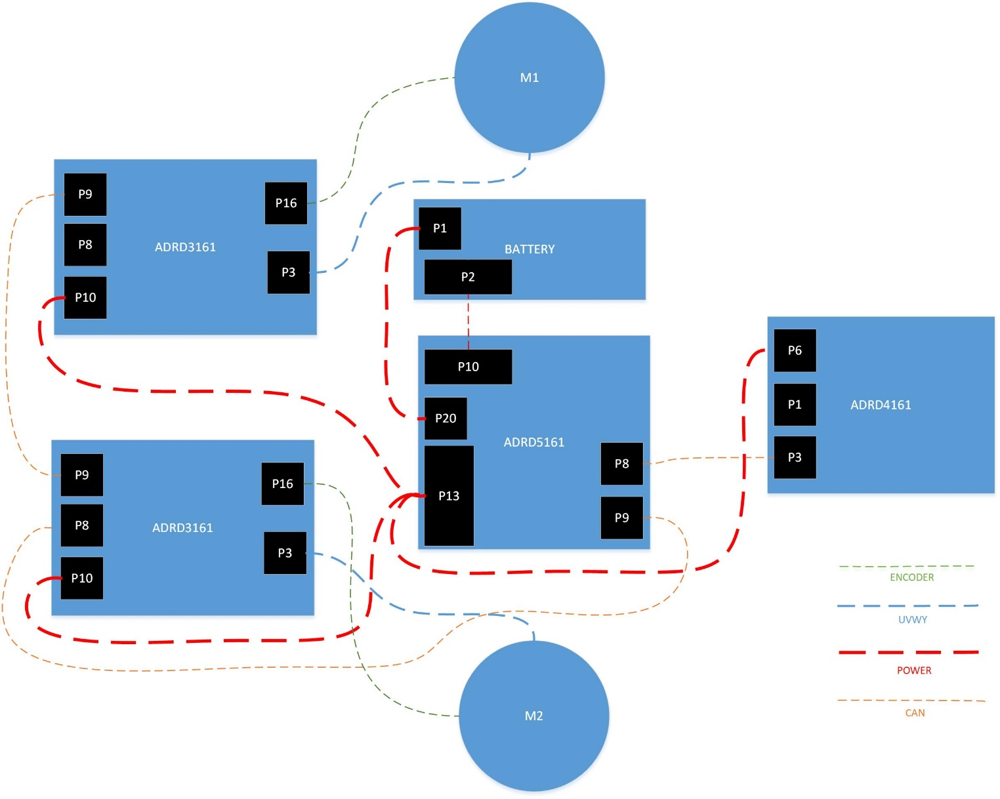
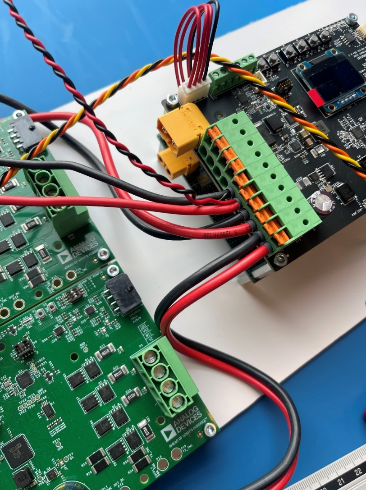
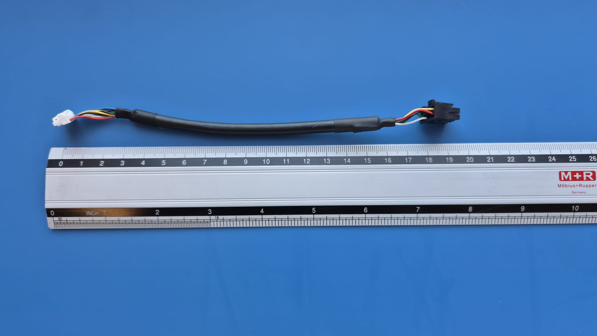
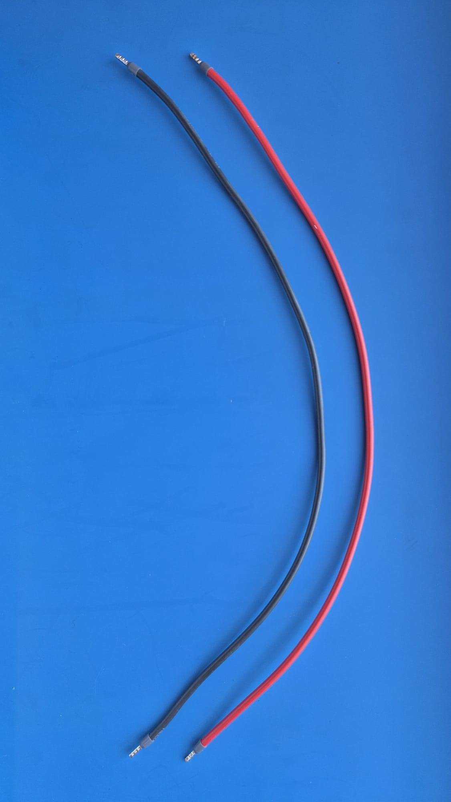

How to assemble the AD-R1M hardware
===================================

Bill of Materials
-----------------

.. list-table:: AD-R1M Bill of Materials
   :name: table-bom
   :header-rows: 1
   :widths: auto

   * - Ref
     - Qty
     - P/N
     - Description
   * - 3D1
     - 4
     - N/A
     - 16 mm caster raiser
   * - 3D2
     - 2
     - N/A
     - Motor mounts
   * - 3D3
     - 2
     - N/A
     - 3D printed camera mount brackets
   * - 3D4
     - 1
     - N/A
     - 3D printed camera housing
   * - 3D5
     - 2
     - N/A
     - Wheel assembly
   * - 3D6
     - 1
     - N/A
     - Electronics sub-assemblies mounting plate
   * - 3D7
     - 1
     - N/A
     - 3D Printed Front Panel
   * - ADI1
     - 2
     - :adi:`QSH5718-51-28-101-10K <qsh5718>`
     - NEMA 23 stepper motor 55Ncm, 2.8A
       
       .. image:: /figures/qsh5718-51-28-101-10k.jpg
          :width: 8rem
   * - ADI2
     - 1
     - :adi:`EVAL-ADTF3175D-NXZ`
     - Time-of-Flight depth camera for perception
      
       .. image:: /figures/eval_adtf3175.png
          :width: 8rem
   * - ADI3
     - 2
     - :adi:`ADRD3161-01Z`
     - Motor Control PCB

       .. image:: /figures/adrd3161.jpg
          :width: 8rem

   * - ADI4
     - 1
     - :adi:`ADRD5161-01Z`
     - BMS
       
       .. image:: /figures/adrd5161.png
          :width: 8rem

   * - ADI5
     - 1
     - :adi:`ADRD4161-01Z`
     - Compute Carrier
     
       .. image:: /figures/adrd4161_board.jpg
          :width: 8rem
       
   * - ADI6
     - 1
     - N/A
     - Battery Holder
   * - E1
     - 1
     - RPi 5
     - Raspberry Pi 5 SBC
   * - E2
     - 1
     - IND16-12B-C
     - Status LED
   * - E3
     - 1
     - 82-4151.1000
     - SPDT Button
   * - E4
     - 1
     - 82-4151.1123
     - SPDT Button
   * - M1
     - 6
     - FA-093W201N05S01
     - Angle bracket
   * - M2
     - 6
     - A-094411M4
     - Panel holder
   * - M3
     - 1
     - K2020-I5 KRAFTBERG
     - 340mm Aluminum 20X20 profile
   * - M4
     - 2
     - K2040-I5 KRAFTBERG
     - 530mm Aluminum 20X40 profile
   * - M5
     - 1
     - K2040-I5 KRAFTBERG
     - 340mm Aluminum 20X40 profile
   * - M6
     - 12
     - M5X8/D912-A4
     - Screw
   * - M7
     - 28
     - FA-096215
     - M5 Profile nut
   * - M8
     - 4
     - JDPE-0501-1001
     - Casters
   * - M9
     - 8
     - B5X25/BN3
     - M5 25mm screw
   * - M10
     - 8
     - B5/BN715
     - 5mm washer
   * - M11
     - 8
     - B5X10/BN3
     - M5 10mm screw
   * - M12
     - 8
     - B5/BN161
     - M5 nut lock
   * - M13
     - 2
     - B4X8/BN3
     - M4 x 8 HEX
   * - M14
     - 2
     - B4/BN1074
     - M4 Washer
   * - M15
     - 8
     - M3X15/DR213
     - Standoff TFF
   * - M16
     - 4
     - M3X20/DR113
     - Standoff TFM
   * - M17
     - 8
     - M3X25/DR213
     - Standoff TFF
   * - M18
     - 16
     - M3X5/D7985
     - Screw
   * - M19
     - 16
     - B3X5/BN610
     - HEX Screw
   * - M20
     - 8
     - B5X16/BN3
     - M5 x 16 screw

Tools needed
------------

.. list-table:: Tools Required
   :name: table-tools
   :header-rows: 1
   :widths: auto

   * - Item
     - Description
   * - Tape measure
     - For measuring frame dimensions and diagonals
   * - Allen Key set
     - For tightening hex screws
   * - Pliers
     - For general assembly
   * - Crimping tools
     - For wire harness assembly

Assembly steps
--------------

Frame
-----

Step 1
^^^^^^

Assemble the frame using the aluminum profiles and the angle brackets.

Make sure it results in a rectangular shape by measuring the diagonals.

Use 2 angle brackets to connect two K2040 profiles.

Place 4 "M2" holders 30mm away from the interior of the profile and 2 in the middle of the 530mm profiles.

.. list-table:: Frame Step 1 - Frame Assembly
   :name: table-frame-step1
   :header-rows: 1
   :widths: auto

   * - Ref
     - Qty
     - P/N
     - Description
   * - M1
     - 6
     - FA-093W201N05S01
     - Angle bracket
   * - M2
     - 6
     - A-094411M4
     - Panel holder
   * - M3
     - 1
     - K2020-I5 KRAFTBERG
     - 340mm Aluminum 20X20 profile
   * - M4
     - 2
     - K2040-I5 KRAFTBERG
     - 530mm Aluminum 20X40 profile
   * - M5
     - 1
     - K2040-I5 KRAFTBERG
     - 340mm Aluminum 20X40 profile
   * - M6
     - 12
     - M5X8/D912-A4
     - Screw
   * - M7
     - 12
     - FA-096215
     - M5 Profile nut

   
.. :height: 3.10694in

Step 2
^^^^^^

Place the wheels using the 3D printed 15mm caster raiser "3D1".

.. list-table:: Frame Step 2 - Wheels
   :name: table-frame-step2
   :header-rows: 1
   :widths: auto

   * - Ref
     - Qty
     - P/N
     - Description
   * - M8
     - 4
     - JDPE-0501-1001
     - casters
   * - 3D1
     - 4
     - N/A
     - 16 mm caster raiser
   * - M7
     - 8
     - FA-096215
     - M5 profile nut
   * - M9
     - 8
     - B5X25/BN3
     - M5 25mm screw
   * - M10
     - 8
     - B5/BN715
     - 5mm washer
..   * - 
..     - 2
..    - JPPF-1001-5100
..     - wheels

   
.. :height: 3.47847in

Step 3
^^^^^^

Install the motor mounts "3D2". The motor mounts need to be placed in the center
of the 530mm longitudinal profiles.

.. list-table:: Frame Step 3 - Motor Mounts
   :name: table-frame-step3
   :header-rows: 1
   :widths: auto

   * - Ref
     - Qty
     - P/N
     - Description
   * - 3D2
     - 2
     - N/A
     - Motor mounts
   * - M7
     - 8
     - FA-096215
     - M5 profile nut
   * - M11
     - 8
     - B5X10/BN3
     - M5 10mm screw

   
.. :height: 3.16667in

Step 4
^^^^^^

.. list-table:: Frame Step 4 - Motors
   :name: table-frame-step4
   :header-rows: 1
   :widths: auto

   * - Ref
     - Qty
     - P/N
     - Description
   * - M20
     - 8
     - B5X16/BN3
     - M5 x 16 screw
   * - M12
     - 8
     - B5/BN161
     - M5 nut lock
   * - ADI1
     - 2
     - QSH5718-51-28-101-10K
     - NEMA 23 stepper motor 55Ncm, 2.8A

Install the motors.

.. image:: ./assemble-hardware/images/image5.png
   :width: 3.48542in
   
.. :height: 2.58194in

Step 5
^^^^^^

Install camera mounts 116.5 mm from the side 135.5 from camera.

Camera mounts and camera housing are 3D printed.

.. list-table:: Frame Step 5 - Camera Mounts
   :name: table-frame-step5
   :header-rows: 1
   :widths: auto

   * - Ref
     - Qty
     - P/N
     - Description
   * - M13
     - 2
     - B4X8/BN3
     - M4 x 8 HEX
   * - M14
     - 2
     - B4/BN1074
     - M4 Washer
   * - 3D3
     - 2
     - NA
     - 3D printed camera mount brackets
   * - 3D4
     - 1
     - NA
     - 3D printed camera housing
   * - ADI2
     - 1
     - EVAL-ADTF3175
     - Time-of-Flight depth camera for perception

   
.. :height: 4.90625in

Step 6
^^^^^^

Install the wheel assembly on the motor

.. list-table:: Frame Step 6 - Wheel Assembly
   :name: table-frame-step6
   :header-rows: 1
   :widths: auto

   * - Ref
     - Qty
     - P/N
     - Description
   * - 3D5
     - 2
     - N/A
     - Wheel assembly

Electronic modules
------------------

Step 1
^^^^^^

Place board spacers.

.. list-table:: Electronics Assembly Step 1 - Spacers
   :name: table-board-step1
   :header-rows: 1
   :widths: auto

   * - Ref
     - Qty
     - P/N
     - Description
   * - 3D6
     - 1
     - N/A
     - Electronics sub-assemblies mounting plate
   * - M15
     - 8
     - M3X15/DR213
     - Standoff TFF
   * - M16
     - 4
     - M3X20/DR113
     - Standoff TFM
   * - M17
     - 4
     - M3X25/DR213
     - Standoff TFF
   * - M18
     - 16
     - M3X5/D7985
     - Screw

.. image:: ./assemble-hardware/images/image7.png
   :width: 5.2625in
   
.. :height: 1.95764in

.. image:: ./assemble-hardware/images/image8.png
   :width: 5.31319in
   
.. :height: 2.5625in

.. image:: ./assemble-hardware/images/image23.png
   :width: 3.16528in
   
.. :height: 4.59375in

Step 2
^^^^^^

Place PCB sub-assemblies.

The BMS board goes above the battery holder on 4 M3X25 standoffs.

.. list-table:: Electronics Assembly Step 2 - Boards
   :name: table-board-step2
   :header-rows: 1
   :widths: auto

   * - Ref
     - Qty
     - P/N
     - Description
   * - M19
     - 16
     - B3X5/BN610
     - HEX Screw
   * - M17
     - 4
     - M3X25/DR213
     - Standoff TFF
   * - ADI3
     - 1
     - ADRD3161
     - Motor Control PCB
   * - ADI4
     - 1
     - ADRD5161 
     - BMS
   * - ADI5
     - 1
     - ADRD4161
     - Compute Carrier
   * - ADI6
     - 1
     - N/A
     - Battery Holder
   * - E1
     - 1
     - RPi 5
     - Raspberry Pi 5 SBC

.. image:: ./assemble-hardware/images/image9.png
   :width: 6.5in
   
.. :height: 2.97708in

Control Panel
-------------

.. list-table:: Control Panel Components
   :name: table-control-panel
   :header-rows: 1
   :widths: auto

   * - Ref
     - Qty
     - P/N
     - Description
   * - E2
     - 1
     - IND16-12B-C
     - Status LED
   * - E3
     - 1
     - 82-4151.1000
     - SPDT Button
   * - E4
     - 1
     - 82-4151.1123
     - SPDT Button
   * - 3D7
     - 1
     - N/A
     - 3D Printed Front Panel

.. image:: ./assemble-hardware/images/image10.png
   :width: 3.36458in
   
.. :height: 2.83264in

.. image:: ./assemble-hardware/images/image11.png
   :width: 3.16667in
   
.. :height: 2.90139in

Wiring Harness
--------------

Main wiring diagram:

   
.. :height: 5.53125in

.. image:: ./assemble-hardware/images/image13.png
   :width: 6.5in
   
.. :height: 3.18542in

Wiring steps:

.. image:: ./assemble-hardware/images/image14.png
   :width: 6.47847in
   
.. :height: 4.01389in

.. image:: ./assemble-hardware/images/image15.png
   :width: 4.32639in
   
.. :height: 4.00903in

   
.. :height: 4.93333in

Wire assemblies:

CAN
^^^

Twisted pair + GND with Molex Micro-Fit 3.0 **43025-0400** connectors on
both sides.

.. image:: ./assemble-hardware/images/image17.png
   :width: 6.5in
   
.. :height: 1.59444in

Motor encoder
^^^^^^^^^^^^^

Wire assembly with Molex Micro-Fit 3.0 **43025-0800** connector on the
motor control board side. For more details check ADRD3161 documentation.

   
.. :height: 3.29306in

Battery balancing
^^^^^^^^^^^^^^^^^

Wire assembly, 4 wires with JST **XHP-4** connectors on both sides.

.. image:: ./assemble-hardware/images/image19.png
   :width: 5.29722in
   
.. :height: 2.73333in

   
.. :height: 6.55972in

Power wires
^^^^^^^^^^^

- 2.5mm wires with bootlace ferrule.

- 450 mm length from the BMS to the motor control board, 2 pairs.

.. image:: ./assemble-hardware/images/image21.png
   :width: 5.27361in

.. image:: ./assemble-hardware/images/image22.png
   :width: 5.89583in

.. image:: ./assemble-hardware/images/image24.png
   :width: 6.5in

.. image:: ./assemble-hardware/images/image25.png
   :width: 6.5in

.. image:: ./assemble-hardware/images/image26.png
   :width: 6.5in
