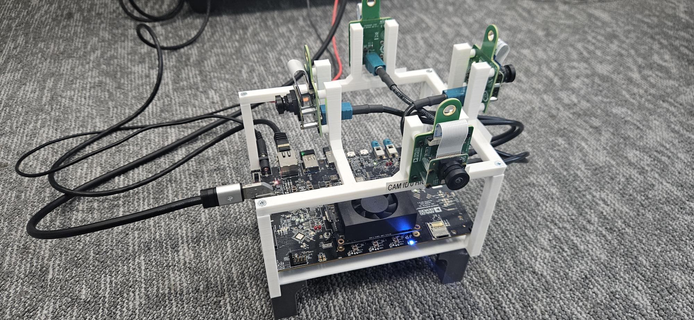
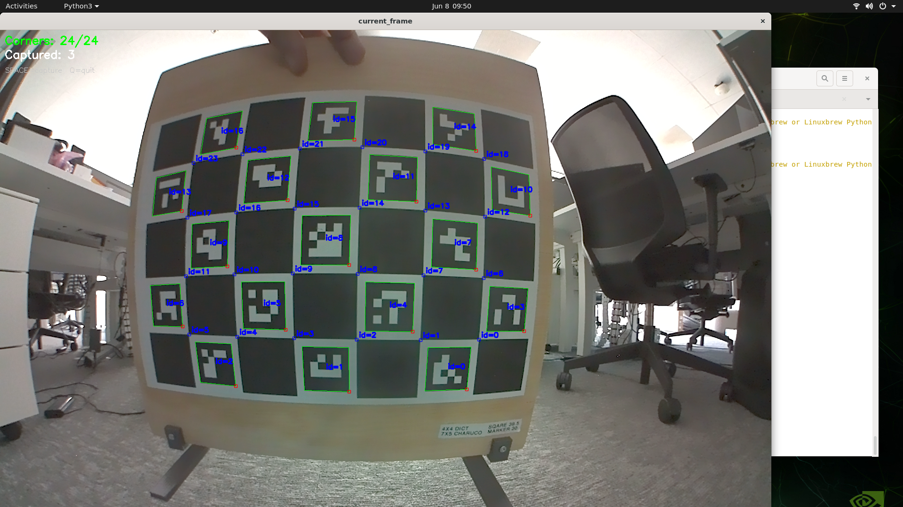
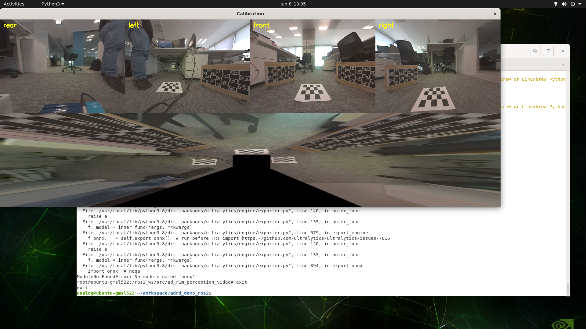
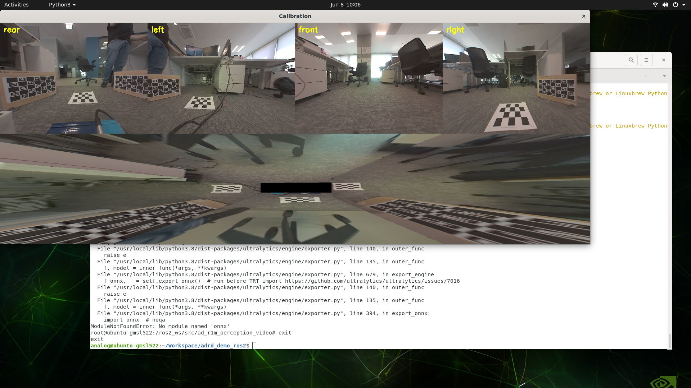

# `ad_r1m_perception_video` ROS2 Package

Unified perception pipeline for the AD-R1M platform with GMSL fisheye cameras on Jetson Xavier. Captures 4 cameras, produces a stitched Bird's Eye View (BEV) with optional floor segmentation - all GPU-accelerated via OpenCV CUDA.


## Requirements

### Hardware
- [AD-GMSL522-SL](https://www.analog.com/en/resources/evaluation-hardware-and-software/evaluation-boards-kits/ad-gmsl522-sl.html) (Jetson Xavier NX + GMSL2 deserializer, JetPack 5.x, L4T R35.x)
- 4x IMX219 with fisheye lens on [AD-GMSL717MIPI-EVK](https://www.analog.com/en/resources/evaluation-hardware-and-software/evaluation-boards-kits/ad-gmsl717mipi-evk.html) serializer boards
- A mounting platform to hold the board and cameras facing outward (front, rear, left, right)



### Built from source in Docker
| Library | Version | Build Config |
|---------|---------|--------------|
| OpenCV | 4.13.0 | CUDA + GStreamer + Python3 bindings |
| TorchVision | 0.16.1 | FORCE_CUDA=1, TORCH_CUDA_ARCH_LIST="7.2" |

### Pulled from NVIDIA
| Library | Version | Source |
|---------|---------|--------|
| PyTorch | 2.1.0a0 | developer.download.nvidia.cn (JetPack 5.1.2) |

### Via pixi (conda)
- ROS Humble (rclpy, sensor_msgs, std_msgs)
- PyYAML

## Host Setup

The NVIDIA container runtime must be configured on the host before running the Docker container.

Check if runtime is installed:

```bash
which nvidia-container-runtime
cat /etc/docker/daemon.json
```

If the config exists but Docker hasn't picked it up, restart Docker:

```bash
sudo systemctl restart docker
docker info | grep -i runtime
```

If the config is missing, create it:

```bash
sudo tee /etc/docker/daemon.json > /dev/null <<EOF
{
  "runtimes": {
    "nvidia": {
      "path": "nvidia-container-runtime",
      "runtimeArgs": []
    }
  },
  "default-runtime": "nvidia"
}
EOF
sudo systemctl restart docker
```

If `nvidia-container-runtime` is not installed at all:

```bash
distribution=$(. /etc/os-release;echo $ID$VERSION_ID)
curl -s -L https://nvidia.github.io/nvidia-docker/gpgkey | sudo apt-key add -
curl -s -L https://nvidia.github.io/nvidia-docker/$distribution/nvidia-docker.list | \
    sudo tee /etc/apt/sources.list.d/nvidia-docker.list

sudo apt-get update
sudo apt-get install -y nvidia-container-toolkit
sudo nvidia-ctk runtime configure --runtime=docker
sudo systemctl restart docker
```

Verify:

```bash
docker info | grep "Default Runtime"
```

### Camera media-ctl configuration

Before running the Docker container, configure the GMSL deserializer media pipeline on the host:

```bash
sudo bash system/ad-gmsl522/host_setup/media_config_imx219.sh
```

This must be run after every boot (or add it to a systemd service).

## Docker

Build from the repo root:

```bash
docker build -f docker/Dockerfile.ad-gmsl522 -t ad-gmsl522 .
```

Run with access to cameras, GPU, and display:

```bash
docker run -it --rm --runtime nvidia --network host \
    --privileged \
    -v /tmp/argus_socket:/tmp/argus_socket \
    -v /tmp/.X11-unix:/tmp/.X11-unix \
    -e DISPLAY=$DISPLAY \
    ad-gmsl522
```

**Display over SSH:** if you're connected over SSH but want the BEV window to
appear on the monitor physically attached to the Jetson, target the local X
server (`:0`) instead of the forwarded display, and allow the container to
connect to it first:

```bash
DISPLAY=:0 xhost +local:root          # run once on the host, before the container
```

then start the container with `-e DISPLAY=:0` in place of `-e DISPLAY=$DISPLAY`.
Without the `xhost` step you'll see repeated `No protocol specified` /
`Can't initialize GTK backend` errors - that's X rejecting the container for
lack of an auth cookie.

Once inside the container, export the TensorRT engine (first run only):

```bash
python3 -m ad_r1m_perception_video.utils.pull_model --engine --imgsz 384
```

The container includes:
- OpenCV 4.13 built from source (CUDA + GStreamer)
- PyTorch 2.1.0 (NVIDIA JetPack 5.1.2 wheel)
- TorchVision 0.16.1 built from source (sm_72 CUDA ops)
- Ultralytics < 8.3
- Pixi with ROS Humble (rclpy, sensor_msgs)

## Architecture

### Why the split?

The Jetson Xavier runs Ubuntu 20.04 (JetPack 5.x) with Python 3.8. ROS Humble officially targets Ubuntu 22.04 - there's no native apt install path on this board. Building ROS from source on 20.04 is fragile and time-consuming.

We use **pixi** (conda-based, via RoboStack) to get ROS Humble in an isolated environment. But the GPU pipeline needs the system Python 3.8 with CUDA-built OpenCV, PyTorch, and TorchVision - all compiled specifically for Xavier. These can't live inside pixi's conda environment.

So we split:

1. **GPU pipeline** - runs on system Python 3.8 with full CUDA stack, no ROS dependency
2. **ROS publisher** - runs on pixi Python (conda) with ROS Humble, no GPU dependency

They communicate over a ZeroMQ socket, which keeps both environments clean and independent while sidestepping the Ubuntu 20.04 vs ROS Humble incompatibility entirely. Since pyzmq only needs numpy and a socket, it installs cleanly in *both* the system and pixi Python environments.

### Overview

The pipeline is split into two processes communicating via ZeroMQ (`zmq_bridge`):

```
perception_video_pipeline.py (system Python - torch, opencv-cuda, ultralytics)
  CameraThreads (4x)
    cap.read() ──────────────▶  upload + cvtColor (GPU)
                                    │
                                    ▼
                                BEV.stitch (GPU remap + blend)
                                    │
                                    ▼
                                FloorSegmentor (FastSAM TRT)
                                    │
                                    ▼
                                Display (cv2.imshow + recording)
                                    │
                                    ▼
                    zmq_bridge.FramePublisher ──▶ ipc:///tmp/perception.ipc

publisher.py (pixi Python - rclpy, sensor_msgs)
  zmq_bridge.FrameSubscriber ──▶ publishes ROS2 topics
```

4 threads capture frames from GStreamer (`nvarguscamerasrc`). The main loop uploads them to GPU, remaps each camera to BEV space using precomputed fused undistort+homography maps, then blends them with gain-corrected feathered weights. Only the final stitched canvas comes back to CPU.

Floor segmentation runs in a single background thread - sequentially runs FastSAM TensorRT inference on GPU for each configured camera, producing binary masks that get remapped to BEV space and overlaid on the canvas.

The BEV canvas, floor masks, and metadata are published together as a ZeroMQ multipart message. The publisher uses a PUB socket with a bounded send queue (latest-frame-wins); the ROS publisher subscribes, always drains to the freshest set, and republishes the frames and masks as `sensor_msgs/Image` topics.

## Package Structure

```
ad_r1m_perception_video/
├── perception_video_pipeline.py  # Main GPU pipeline (standalone, no ROS)
├── publisher.py                  # ROS2 publisher node (subscribes to zmq_bridge)
├── zmq_bridge.py                 # ZeroMQ PUB/SUB frame transport (atomic multipart)
├── display.py                    # UI windows + video recording
├── capture/
│   ├── Camera.py                 # Abstract base class
│   └── GstreamerCamera.py        # nvarguscamerasrc implementation
├── processing/
│   ├── BEV.py                    # Bird's eye view stitching (GPU)
│   └── FloorSegmentor.py         # FastSAM floor segmentation
└── utils/
    ├── ExtrinsicsCalibrator.py   # Extrinsic calibration (height, pitch, yaw, offsets)
    └── IntrinsicCalibrator.py    # Intrinsic calibration (fisheye K + D)
```

## Setup

Download the FastSAM model and export to TensorRT engine (recommended):

```bash
python3 -m ad_r1m_perception_video.utils.pull_model --engine --imgsz 384
```

This downloads `FastSAM-s.pt` and exports `FastSAM-s_384_384.engine` into `models/floor/`. The `.engine` file is platform-specific and must be built on the target Jetson.

To download the model without converting:

```bash
python3 -m ad_r1m_perception_video.utils.pull_model
```

## Running

Inside the Docker container:

```bash
# Start both pipeline + ROS publisher
pixi run perception_video

# Or individually:
pixi run pipeline    # Video pipeline with no ros publisher
pixi run publisher   # ROS publisher only (needs pipeline running)
```

## Published Topics

| Topic | Type | Description |
|-------|------|-------------|
| `/perception/bev` | `sensor_msgs/Image` | Stitched BEV canvas (BGR8) |
| `/perception/floor_mask/<cam_key>` | `sensor_msgs/Image` | Floor segmentation mask per camera (mono8) |

Topic names are configurable in `config/pipeline.yaml`.

## Capture

`capture/` uses a factory pattern. `Camera.py` defines the abstract base class (`start`, `get_frame`, `stop`). `GstreamerCamera.py` implements it for GMSL cameras via `nvarguscamerasrc`.

To add a new camera type (e.g. USB, RealSense, simulated), create a class that extends `Camera`, then register it in `capture/__init__.py`. The `type` field in the config selects which implementation to use:

```yaml
config:
  type: "gstreamer"   # matches the factory in capture/__init__.py
```

## Configuration

All parameters are in `config/pipeline.yaml`.

Each camera entry has `config` and `calibration`. The `type` field in `config` determines which capture class gets instantiated. The `camera_matrix` was calibrated at `calibration_width x calibration_height` and gets scaled up to capture resolution internally.

BEV settings control the output canvas size and how many meters of ground are visible.

Floor segmentation can run on a subset of cameras to save inference time.


## Keyboard Controls

| Key | Action |
|-----|--------|
| `V` | Start/stop video recording |
| `Q` | Quit |

Recordings saved as `bev_YYYYMMDD_HHMMSS.avi` in the package folder.

## Calibration

### Intrinsic Calibration

Calibrates the fisheye lens distortion parameters for a single camera using a ChArUco board (7x5, 39.5mm square, 30mm marker, DICT_4X4_100).

```bash
python3 -m ad_r1m_perception_video.utils.IntrinsicCalibrator --sensor 3
```

**Procedure:**
1. Hold the ChArUco board in front of the camera
2. Press **SPACE** to capture frames at varied angles and distances (aim for 20-30 images)
3. Press **Q** to quit - calibration runs automatically on captured images



**Example output (front camera, sensor_id=3):**
```
Found 27 images
  frame_0.png: 17 markers, 24 charuco corners
  frame_1.png: 17 markers, 24 charuco corners
  ...
Images with detected board: 27/27
Reprojection error: 0.4046 pixels
Camera Matrix:
 [[574.626  0.     815.908]
 [  0.    581.444  611.238]
 [  0.      0.       1.   ]]
Distortion Coefficients (k1, k2, k3, k4):
 [ 0.05436565 -0.02862347  0.02166409 -0.00622895]

Rescaled to 820x616:
Camera Matrix:
 [[287.313   0.     407.954]
 [  0.    290.722  305.619]
 [  0.      0.       1.   ]]
Distortion Coefficients (unchanged):
 [ 0.05436565 -0.02862347  0.02166409 -0.00622895]
```

Copy the rescaled camera matrix and distortion coefficients into the corresponding camera's `calibration` section in `config/pipeline.yaml`.

### Extrinsic Calibration

Calibrates height, pitch, yaw, and inter-camera offsets using 3 checkerboards (4x3 inner corners, 5cm squares) and 2 ChArUco boards (7x5, 39.5mm square, 30mm marker, DICT_4X4_50).

Place a checkerboard in front of each camera (for height + pitch). Place the two ChArUco boards in the overlap zone between adjacent cameras so both cameras can see them (for inter-camera translation + yaw).

```bash
python3 -m ad_r1m_perception_video.utils.ExtrinsicsCalibrator
```

**Procedure (order matters):**

1. **C - Front first:** Place both boards where left, front, and right cameras overlap. Press **C**. This calibrates front relative to left and right (averaged).



2. **SPACE - Rear second:** Move boards to where rear, left, and right cameras overlap. Press **SPACE**. This calibrates left and right relative to rear.



3. Press **Q** to quit.

**Controls:**
| Key | Action |
|-----|--------|
| `C` | Calibrate left→front + right→front (averaged) |
| `SPACE` | Calibrate rear→left + rear→right |
| `Q` | Quit |

**Example output:**
```
Calibrating: ['rear', 'left', 'front', 'right']
SPACE = rear<->left + rear<->right, C = left<->front + right<->front (averaged), Q = quit

  --- Calibrating pair: ['left', 'front'], ref=left (target left half) ---
  [left] Checkerboard: height=26.43cm pitch=3.68deg
  [front] Checkerboard: height=26.27cm pitch=3.18deg
  [left] ChArUco: detected
  [front] ChArUco: detected
  [front] Offset from left: dX=9.7cm dY=1.2cm dZ=-0.2cm
  [front] Absolute: X=9.7cm Y=1.2cm Yaw=2.8deg
  [BEV updated]

  --- Calibrating pair: ['right', 'front'], ref=right (target right half) ---
  [right] Checkerboard: height=26.70cm pitch=0.76deg
  [front] Checkerboard: height=26.27cm pitch=3.18deg
  [right] ChArUco: detected
  [front] ChArUco: detected
  [front] Offset from right: dX=-11.2cm dY=1.1cm dZ=0.4cm
  [front] Absolute: X=-11.2cm Y=1.1cm Yaw=2.0deg
  [BEV updated]
  [front] Averaged: X=0.0cm Y=10.3cm Yaw=2.4deg
    via left:  X=9.7cm Y=1.2cm Yaw=2.8deg
    via right: X=-11.2cm Y=1.1cm Yaw=2.0deg

  --- Calibrating pair: ['rear', 'left'], ref=rear (ref right half) ---
  [rear] Checkerboard: height=26.24cm pitch=5.13deg
  [left] Checkerboard: height=26.43cm pitch=3.68deg
  [rear] ChArUco: detected
  [left] ChArUco: detected
  [left] Offset from rear: dX=-9.7cm dY=9.1cm dZ=-0.2cm
  [left] Absolute: X=-9.7cm Y=9.1cm Yaw=83.4deg
  [BEV updated]

  --- Calibrating pair: ['rear', 'right'], ref=rear (ref left half) ---
  [rear] Checkerboard: height=26.24cm pitch=5.13deg
  [right] Checkerboard: height=26.70cm pitch=0.76deg
  [rear] ChArUco: detected
  [right] ChArUco: detected
  [right] Offset from rear: dX=11.2cm dY=11.4cm dZ=0.4cm
  [right] Absolute: X=11.2cm Y=11.4cm Yaw=266.0deg
  [BEV updated]
```

Copy the height, pitch, yaw, and offset values into `config/pipeline.yaml` for each camera.

