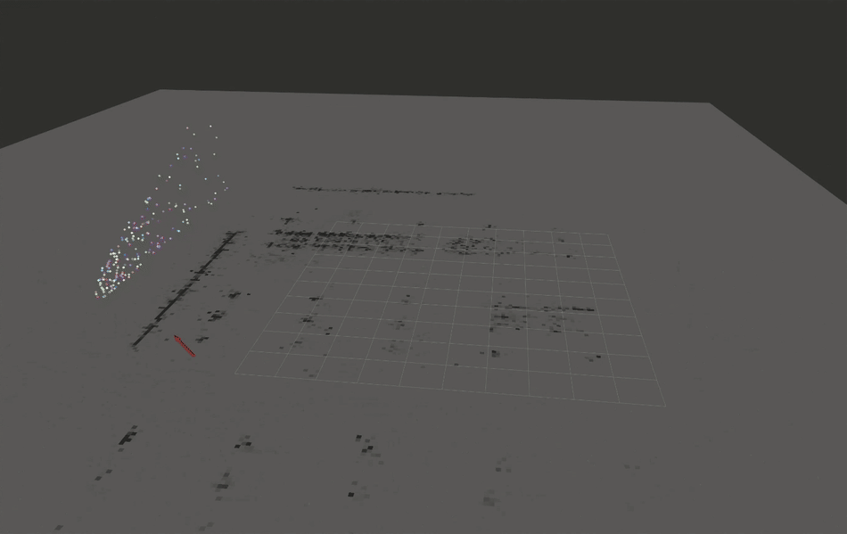

# `ad_r1m_pointcloud_to_occupancygrid` ROS 2 package
This package converts `sensor_msgs/PointCloud2` data to both `nav_msgs/OccupancyGrid` and `grid_map_msgs/GridMap` 2D map data based on intensity and / or height.



[](https://docs.ros.org/en/humble/)

## Build
```
cd ~/<your_ros_workspace>/src 
git clone https://github.com/analogdevicesinc/ad_r1m_ros2
cd ~/ros2_ws/ 
colcon build --packages-select ad_r1m_pointcloud_to_occupancygrid --symlink-install
```
Don't foget to `source ~/<your_ros_workspace>/install/setup.bash`. 


## Features
- Few dependencies (ROS 2, PCL, and grid_map_msgs mainly) [ROS installation](http://wiki.ros.org/ROS/Installation)
- **Dual output format support**: publishes both `nav_msgs/OccupancyGrid` and `grid_map_msgs/GridMap`
- **Additional pointcloud filtering**:
  - **Radius Outlier Removal** – removes isolated points that lack nearby neighbors.
  - **Statistical Outlier Removal** – eliminates noisy spikes based on neighborhood statistics.
  - **Pass-Through Z Filter** – keeps only points within a specified height range (useful for filtering floor/ceiling).
  - **Voxel Grid Downsampling** – reduces point density and computation by keeping one point per voxel.
  - **Clustering (optional)** – segments the cloud and allows ignoring very small or noisy clusters.
  - **Gaussian Z-Weighting** – weights points based on height using a Gaussian curve (mean ≈ robot mid-height, stddev ≈ half robot height) to suppress floor/ceiling noise in intensity mapping.
  - **Normal Mean Averaging** – maintains a cumulative average of all generated grids for stable maps in static environments.
  - **Moving Average Filtering** – exponential smoothing of consecutive maps to reduce noise while allowing gradual adaptation to dynamic environments.
  - **Initial Map Loading** – seed the averaging with a previously saved occupancy grid so the map doesn't start from scratch each session. Supports loading from a PGM+YAML file or from a ROS topic (e.g. `map_server`). A configurable weight controls how resistant the loaded map is to new observations.


# Getting started

Start the node in a **new terminal** :
```r
ros2 launch ad_r1m_pointcloud_to_grid build_occuupancy_grid.launch.py
```
Alternatively, start with subscribing to `/my_cloud_topic`:
```r
ros2 launch ad_r1m_pointcloud_to_grid build_occuupancy_grid.launch.py topic:=my_cloud_topic
```

Start the visualization in a **new terminal** :
```r
ros2 launch ad_r1m_pointcloud_to_occupancygrid rviz.launch.py
```

## Dual Output Format Support

The package supports publishing both `nav_msgs/OccupancyGrid` and `grid_map_msgs/GridMap` message types simultaneously. This allows for better integration with different ROS 2 packages that may prefer one format over the other.

### New Parameters

| Parameter | Type | Default | Description |
|-----------|------|---------|-------------|
| `mapi_gridmap_topic_name` | string | `intensity_gridmap` | Topic name for intensity GridMap |
| `maph_gridmap_topic_name` | string | `height_gridmap` | Topic name for height GridMap |
| `cell_size` | float | `0.5f` | Cell size (m) of each point's projection |
| `length_x` | float | `20.0f` | Map length (m) on X-axis |
| `length_y` | float | `30.0f` | Map length (m) on Y-axis |
| `filter_enable` | bool |  `true` | When true, individual filters (ROR, SOR, pass-through, voxel, etc.) follow their own enable/disable settings. <br>When false, all filters are forcibly disabled, regardless of any per-filter configuration. <br>Use this to quickly turn the entire filtering system on or off without modifying each filter parameter.|
| `z_min` | float | `-10000.0f` | Minimum height for 3D points (m) |
| `z_max` | float | `10000.0f` | Maximum height for 3D points (m) |
| `ror_enable` | bool | `true` | Enable/Disable Radius outlier removal (ROR) filter |
| `ror_radius` | float | `0.25f` | Search radius around each point (m) |
| `ror_min_neighbors_in_radius` | int | `5` | Minimum number of neighbors required within `ror_radius`.<br> Points with fewer neighbors are removed. |
| `sor_enable` | bool | `true` | Enable/Disable Statistical outlier removal (SOR) filter |
| `sor_mean` | int | `30` |  Number of nearest neighbors considered when evaluating local statistics |
| `sor_stddev_mul_thresh` | float | `0.5f` | Standard deviation multiplier.<br> Points whose distance exceeds mean+sor_stddev_mul_thresh*std_dev (m) are removed. |
| `pass_enable` | bool | `true` | Enable/Disable pass-through filter |
| `pass_z_min` | float | `0.0f` | Minimum Z value to keep (m) |
| `pass_z_max` | float | `2.0f` | Maximum Z value to keep (m) |
| `voxel_enable` | bool | `true` | Enable/Disable voxel-grid downsampling.<br> Reduces point count and enforces uniform density.|
| `voxel_lx` | float | `0.07f` | Leaf size in the X direction |
| `voxel_ly` | float | `0.07f` | Leaf size in the Y direction |
| `voxel_lz` | float | `0.07f` | Leaf size in the Z direction |
| `cluster_enable` | bool | `true` | Enable/Disable point clustering.<br> Used to isolate meaningful clusters of points and remove small noisy fragments. |
| `cluster_tolerance` | float | `0.2f` | Maximum distance (m) between neighboring points within the same cluster |
| `cluster_min_size` | int | `10` | Minimum number of points in a valid cluster |
| `cluster_max_size` | int | `25000` | Maximum number of points in a valid clusters |
| `gaussian_enable` | bool | `true` | Enables/Disables Gaussian weighting. <br> Each point is weighted based on how close its Z-value is to a Gaussian distribution. <br> Points near the robot’s obstacle-height zone contribute strongly, while floor/ceiling <br> points get down-weighted. |
| `gaussian_mean` | float | `0.2f` | Center height (m) of the Gaussian (typically robot mid-height) |
| `gaussian_stddev` | float | `0.05f` | Width (m) of the Gaussian (approx. half robot height recommended) |
| `normal_averaging_enable` | bool | `false` | Enable/Disable normal mean averaging over all maps produced so far.<br> Produces a stable long-term map in static environments|
| `moving_average_enable` | bool | `false` | Enable/Disable exponential moving average. <br> Suited for dynamic environments where old data should slowly fade out. |
| `ma_alpha` | float | `0.9f` | Smoothing factor [0, 1]. <br>`ma_alpha` close to 1 &rarr; fast reaction to new data.<br> `ma_alpha` close to 0 &rarr; slow smoothing of noise. |
| `initial_map_source` | string | `""` | Initial map source: `"file"` = load from PGM+YAML, `"topic"` = subscribe to a map topic, `""` = disabled (default, backward compatible). |
| `initial_map_file` | string | `""` | Path to the `.yaml` map file (used when `initial_map_source` = `"file"`). |
| `initial_map_topic` | string | `"/map"` | Topic to subscribe for the initial map (used when `initial_map_source` = `"topic"`). Uses transient_local QoS to receive latched maps from `map_server`. |
| `initial_map_weight` | float | `50.0f` | Number of virtual observations the loaded map represents. Controls how resistant the initial map is to new pointcloud data. Higher = more persistent. With weight=50, the first new frame blends at 1/51 (~2%). |


### Output Topics

The node publishes to four topics simultaneously:

**OccupancyGrid format:**
- `intensity_grid` (`nav_msgs/OccupancyGrid`)
- `height_grid` (`nav_msgs/OccupancyGrid`)

**GridMap format:**
- `intensity_gridmap` (`grid_map_msgs/GridMap`)
- `height_gridmap` (`grid_map_msgs/GridMap`)

### Usage Example

```bash
# Launch with custom GridMap topic names
ros2 launch ad_r1m_pointcloud_to_occupancygrid build_occupancy_grid.launch.py topic:=my_pointcloud mapi_gridmap_topic_name:=my_intensity_map maph_gridmap_topic_name:=my_height_map
```

## Initial Map Loading

When using NVIDIA® Isaac™ ROS Visual SLAM (or any SLAM system) across multiple sessions, the occupancy grid
normally starts from a blank state and must be rebuilt from scratch. The initial map
loading feature allows the node to start with a previously saved occupancy grid as its
baseline, so new landmark observations blend into the existing map via the normal
averaging logic.

**Requirements:**
- `normal_averaging_enable` must be `true` (the loaded map seeds the averaging state)
- The loaded map must have the same dimensions (width x height in cells) as the node's
  grid configuration. If they don't match, the node logs an error and falls back to a
  blank grid.

### From a file (PGM + YAML)

Load a map previously saved with `nav2_map_server`'s `map_saver_cli`:

```bash
ros2 launch ad_r1m_pointcloud_to_occupancygrid build_occupancy_grid.launch.py \
    topic:=/visual_slam/vis/landmarks_cloud \
    initial_map_source:=file \
    initial_map_file:=/ros_data/cuvslam_map_grid.yaml
```

The node parses the YAML to find the PGM image path, reads the P5 binary PGM, and
converts pixel values to occupancy [0-100] using the `occupied_thresh` and
`free_thresh` values from the YAML.

### From a topic

Subscribe to a running `map_server` and use the first published map:

```bash
# Start map_server with the saved map
ros2 run nav2_map_server map_server --ros-args \
    -p yaml_filename:=/ros_data/cuvslam_map_grid.yaml

# Start the grid node
ros2 launch ad_r1m_pointcloud_to_occupancygrid build_occupancy_grid.launch.py \
    topic:=/visual_slam/vis/landmarks_cloud \
    initial_map_source:=topic \
    initial_map_topic:=/map
```

The subscription uses `transient_local` durability QoS to receive the latched map from
`map_server`. After the first message is received, the subscription is destroyed.

### Tuning the weight

The `initial_map_weight` parameter controls how many "virtual observations" the loaded
map represents. The normal averaging formula is:

```
new_avg = old_avg + (new_value - old_avg) / n
```

| Weight | First frame influence | Use case |
|--------|----------------------|----------|
| 10 | ~9% | Light prior, quick adaptation |
| 50 | ~2% | Balanced (default) |
| 200 | ~0.5% | Strong prior, very slow drift |

## Saving the Occupancy Grid

To save the built occupancy grid for later use with Nav2, use the `map_saver_cli` tool. The `-t` flag specifies the topic to subscribe to:

```bash
ros2 run nav2_map_server map_saver_cli -f /ros_data/cuvslam_map_grid -t intensity_grid --ros-args -p save_map_timeout:=20.0
```

> **Tip:** During the timeout period, you may need to move the robot slightly so that the SLAM system generates a new landmark message. This triggers a new occupancy grid publication that `map_saver` can capture. If the robot is stationary, no new map messages may be published and the saver will time out.

## Post-Processing Saved Maps from Visual SLAM

When building occupancy grids from visual SLAM pointclouds (e.g. Isaac ROS Visual SLAM landmarks), the saved map files may need adjustments before use with Nav2:

**PGM rotation:** The `.pgm` file is rotated by approximately 180 degrees. Rotate it before use:

```bash
convert /ros_data/cuvslam_map_grid.pgm -rotate 180 /ros_data/cuvslam_map_grid.pgm
```

**Map YAML adjustments:** Because visual SLAM produces sparse pointclouds, the occupancy percentages in the grid tend to be low. In the `.yaml` file:
- Lower `occupied_thresh` to detect cells with lower occupancy as obstacles
- Adjust `free_thresh` to match the actual occupancy distribution
- Verify the `origin` [x, y, theta] values match the rotated map

**Intensity factor tuning:** The `intensity_factor` parameter controls how strongly points contribute to cell occupancy. For sparse visual SLAM pointclouds, use a lower value (e.g. 0.3) to avoid saturating the grid. For dense LiDAR data, the default (1.0) is appropriate.

## Loading and Updating an Existing Map

To resume mapping across sessions — loading a previously saved map and updating it with new observations:

1. Save the Isaac ROS Visual SLAM map (`.mdb` database) and the occupancy grid (`.pgm` + `.yaml`)
2. On the next session, start Isaac ROS Visual SLAM with `load_map_folder_path` pointing to the saved `.mdb` map
3. Start the occupancy grid node with the saved grid as the initial map:

```bash
ros2 launch ad_r1m_pointcloud_to_occupancygrid build_occupancy_grid.launch.py \
    topic:=/visual_slam/vis/landmarks_cloud \
    initial_map_source:=file \
    initial_map_file:=/ros_data/cuvslam_map_grid.yaml
```

New landmark observations will blend into the loaded map via the normal averaging logic. The `initial_map_weight` parameter controls how resistant the loaded map is to updates (see [Tuning the weight](#tuning-the-weight) above).

> **Note:** `normal_averaging_enable` must be `true` for initial map loading to work — the loaded map seeds the averaging state.

## QoS Configuration

The package is configured to use `BEST_EFFORT` reliability QoS policy for the input point cloud subscription. This ensures compatibility with typical LiDAR sensor publishers that often use this policy for performance reasons. This prevents QoS compatibility warnings that might appear with the default `RELIABLE` policy.

## Related solutions
- [https://github.com/jkk-research/pointcloud_to_grid/tree/ros2](https://github.com/jkk-research/pointcloud_to_grid/tree/ros2) - This is a ROS package used for occupancy grid and grid map building from raw LIDAR pointcloud data. Does not include pre-filtering options for the pointcloud.
- [github.com/ANYbotics/grid_map](https://github.com/ANYbotics/grid_map) - This is a C++ library with ROS interface to manage two-dimensional grid maps with multiple data layers.
- [github.com/306327680/PointCloud-to-grid-map](https://github.com/306327680/PointCloud-to-grid-map) - A similar solution but instead PointCloud2 it uses PointCloud